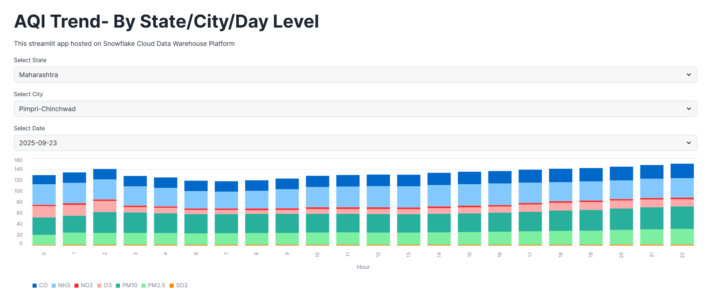
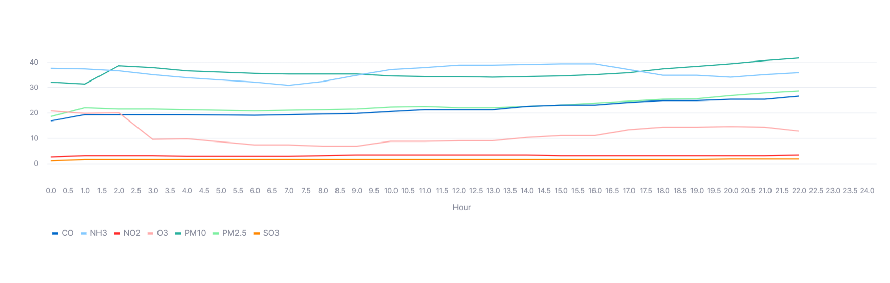
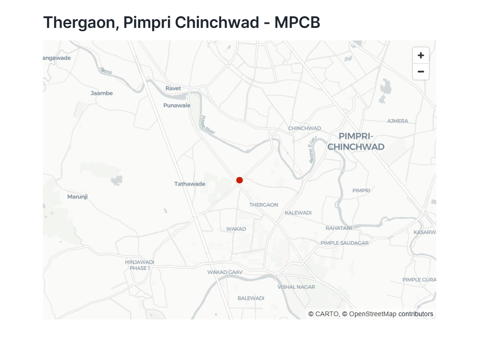

# Air Quality ETL Pipeline

An end-to-end ETL (Extract, Transform, Load) pipeline for ingesting, processing, and visualizing Air Quality Index (AQI) data for India.  
The pipeline automates the hourly collection of air quality data from the Indian government open data API, processes it in Snowflake using Snowpark & SQL, and provides interactive dashboards built with Streamlit.

---

## Table of Contents

- [Features](#features)
- [Architecture](#architecture)
- [Technologies Used](#technologies-used)
- [License](#license)

---

## Features

- **Automated Data Ingestion:**  
  Fetches hourly AQI data from the Indian government open data API using GitHub Action scripts and uploads it to Snowflake stages.

- **Data Processing & Transformation:**  
  Utilizes Snowflake SQL to clean, deduplicate, and transform raw data. Includes custom Python UDFs for AQI calculation and pollutant identification.

- **Aggregation & Analytics:**  
  Computes AQI at station, city, and national levels. Supports trend analysis and historical data exploration.

- **Interactive Visualization:**  
  Streamlit dashboards connect to Snowflake for real-time, interactive data exploration and visualization.

- **Orchestration & Scheduling:**  
  Uses Snowflake Tasks for automated transformations and GitHub Actions for scheduled ingestion and CI/CD.

---

## Architecture

```
API (Gov Data) → Python Ingestion Scripts → Snowflake Stages → Snowflake Tables (Staging, Processed, Aggregated) → Snowflake UDFs & SQL → Streamlit Dashboards
```

---

## Project Images


*ETL Pipeline Architecture*


*Sample Streamlit Dashboard*


*Sample Streamlit Dashboard*


*Sample Streamlit Dashboard*

<!-- Add or update image filenames as per your assets folder -->

---


## Technologies Used

- **Python**
- **Snowflake** (Snowpark, SQL, Tasks, UDFs)
- **Streamlit**
- **GitHub Actions**

---

## License

This project is licensed under the MIT License.